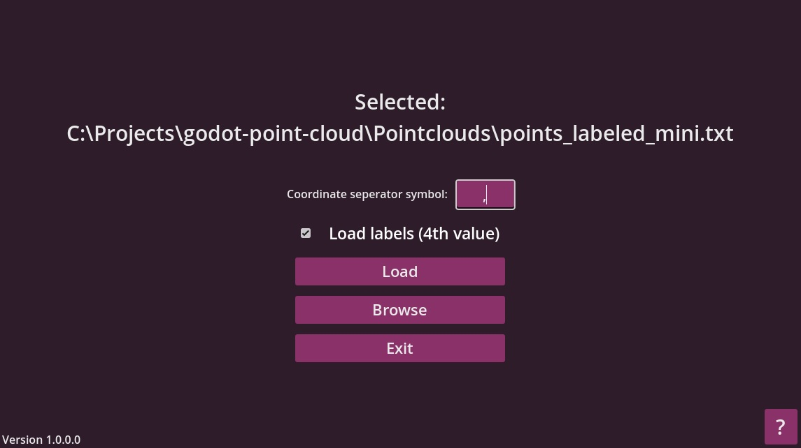

# Godot pointcloud viewer

	

This application can render 3D pointclouds with label support, and you can inspect them (fly around) in first person. Currently the release works only on windows machines. You can try compiling the project yourself on your desired OS.

### Features

+ Render 3D labeled or unlabeled pointclouds (I have not properly limit tested it, but it can run a 500k pointcloud with no issues. Reading the file can take some time, depending on the size of the pointcloud file ~500k labeled points ~20 seconds)
+ Explore the pointcloud in first person, change basic control parameters - speed, sensitivity, boost
+ Change the look of the pointcloud - change each label color, their corresponding point sizes. Change the background color
+ Some basic display settings e.g. FOV, fullscreen

### How to use

1. Download the latest release
2. Prepare your pointcloud file

	2.1. File extension should be *.txt* or *.csv*
	
	2.2. Points should be seperated by a new line
	
	2.3. Each line should be in the following format:
		*x,y,z,label(optional)*
		
	2.3.1. You can choose what seperator you use, but it has to be one symbol - cannot be *comma* + *space* as it's two symbols
		
	2.3.2. label is optional
		
	2.3.3. *z* corresponds to height
	
4. Open the application, select your pointcloud file
5. Basic controls are shown on the screen, settings can be found by pressing the ESC button
### Future work
I don't plan on spending a lot of time on this project, but some features that I still would like to implement:
+ Built in animations (orbit) for easy video recording
+ Proper handling of seperators (currently can be buggy)
+ Writting a custom shader - currently the points are really 2D squares. Also could probably get some more performance out of this
+ Adding some template pointclouds

### Some screenshots

Menu screen:

	

View + settings:

	

